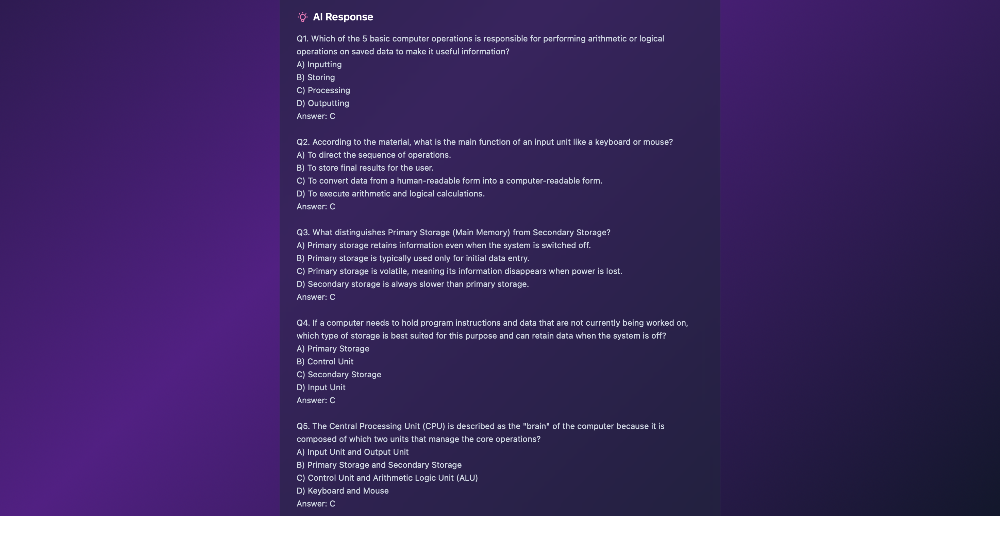
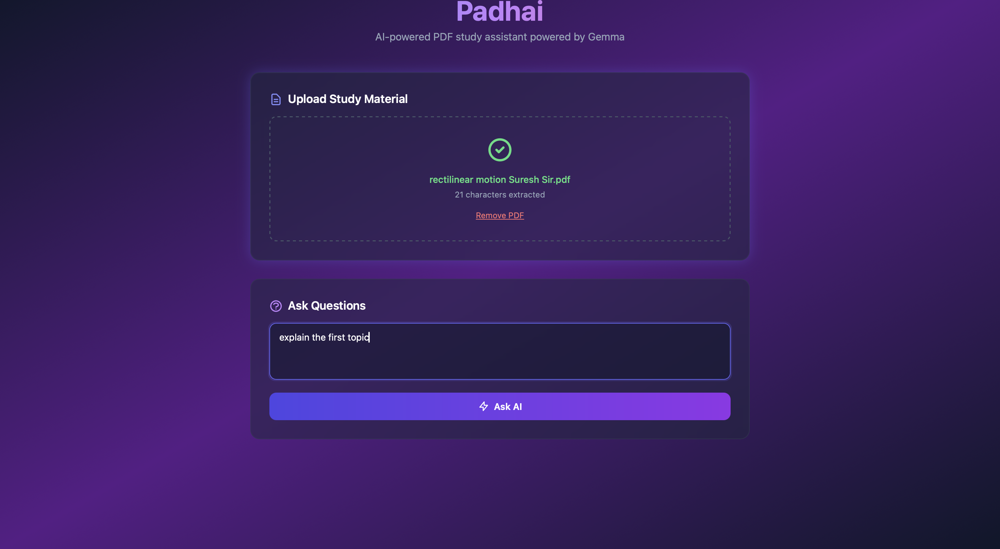
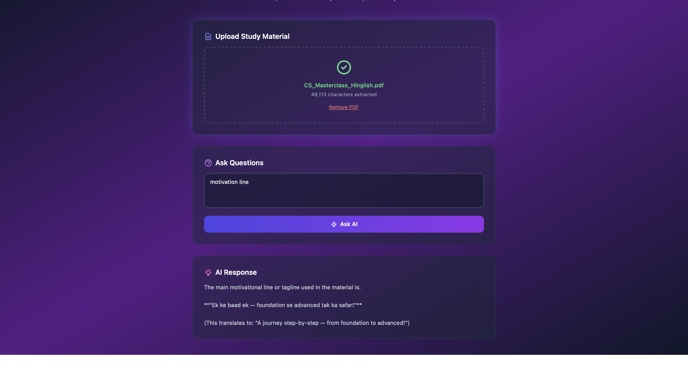
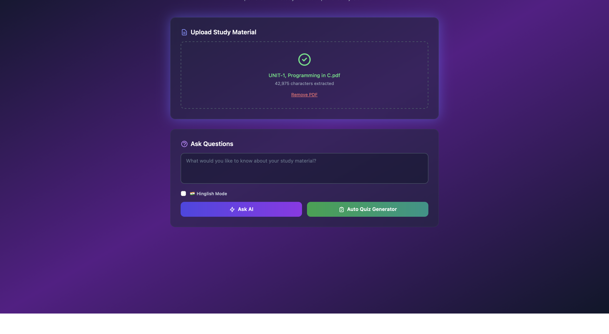

# 📚 Padhai

> An AI-powered study assistant that helps you learn from PDF documents using local LLM ✨



## 🚀 Features

- 📄 **PDF Upload** - Upload any PDF document for study
- ✂️ **Text Extraction** - Automatically extracts text from PDF files
- 🤖 **AI-Powered Q&A** - Ask questions about your study material and get instant answers
- 🇮🇳 **Hinglish Mode** - Toggle to get responses in Hindi-English mix
- 🧠 **Auto Quiz Generator** - Generate 5 MCQ questions from your PDF instantly!
- 💻 **Local LLM** - Runs entirely on your machine using Ollama (no data leaves your computer!)

## 📸 Screenshots

### 1. Home Page - PDF Upload

*Upload your study material (PDF) to get started*

### 2. AI Q&A Response

*Ask questions and get instant AI-powered answers*

### 3. Quiz Generation

*Auto-generate 5 MCQ questions from your PDF*

### 4. Hinglish Mode

*Toggle Hinglish for Hindi-English mixed responses*

## 📋 Prerequisites

- 🐍 Python 3.10+
- 🦙 [Ollama](https://ollama.ai/) installed and running

## 🛠️ Setup

1. **Clone the repository**
```bash
git clone https://github.com/sagar-coder29/Padhai.git
cd Padhai
```

2. **Create a virtual environment**
```bash
python -m venv .venv
source .venv/bin/activate  # On Windows: .venv\Scripts\activate
```

3. **Install dependencies**
```bash
pip install -r requirements.txt
```

4. **Start Ollama**

Make sure Ollama is running with the gemma model:
```bash
ollama serve
ollama pull gemma4:e4b
```

5. **Run migrations**
```bash
python manage.py migrate
```

6. **Start the development server**
```bash
python manage.py runserver
```

7. **Open in browser**
Navigate to `http://localhost:8000` 🎉

## 📖 Usage

1. Click 📁 "Choose File" to select a PDF document
2. Click ⬆️ "Upload PDF" to process the document
3. Enter your question in the text field
4. Click ❓ "Ask" to get an AI-generated answer based on the PDF content

## 💻 Tech Stack

| Technology | Purpose |
|------------|---------|
| 🐍 Django 4.2+ | Backend Framework |
| 📄 pdfplumber, PyPDF2 | PDF Processing |
| 🤖 Gemma via Ollama | AI Model |
| 🌐 HTML/CSS/JS | Frontend |

## 📁 Project Structure

```
padhai/
├── padhai/              # Django project settings
│   ├── settings.py
│   ├── urls.py
│   └── wsgi.py
├── core/                # Main application
│   ├── views.py         # API endpoints
│   ├── urls.py
│   └── templates/       # HTML templates
├── assets/              # Screenshots
├── manage.py
└── requirements.txt
```

## 🔗 API Endpoints

| Endpoint | Method | Description |
|----------|--------|-------------|
| `/` | GET | Home page |
| `/api/upload-pdf/` | POST | Upload and process PDF |
| `/api/ask/` | POST | Ask a question about the PDF |

## 🤝 Contributing

Contributions are welcome! Feel free to open issues and pull requests.

## 📝 License

MIT License - feel free to use this project for your studies!

---

Made with ❤️ for students everywhere 📚🎓
